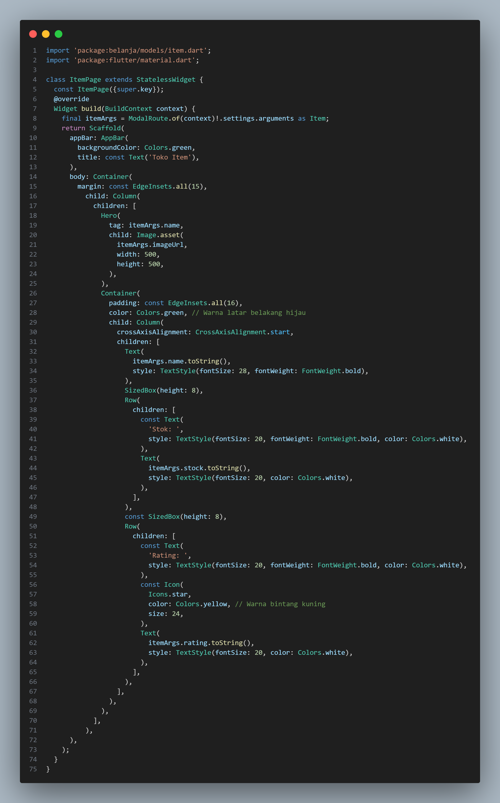

# belanja

Ujian Tengah Semester
> Nama  : Dandy Wahyu Syahputra Kelas: TI - 3A
 NIM: 2141720002

## Praktikum 4

- Code: 

- Hasil: 

## Tugas Praktikum 1

1. Selesaikan Praktikum 1 sampai 4, lalu dokumentasikan dan push ke repository Anda berupa screenshot setiap hasil pekerjaan beserta penjelasannya di file README.md!

2. Silakan implementasikan di project baru "basic_layout_flutter" dengan mengakses sumber ini: https://docs.flutter.dev/codelabs/layout-basics

3. Kumpulkan link commit repository GitHub Anda ke spreadsheet yang telah disediakan!

### Konsep Navigasi dan Rute

Perpindahan halaman di Flutter, ditangani oleh Navigator dengan melibatkan konsep sebagai berikut:

* Navigator: sebuah widget yang mengatur tumpukan (struktur data stack) dari objek rute.
* Route: sebuah objek yang merepresentasikan tampilan, umumnya diimplementasikan oleh class seperti MaterialPageRoute.

Sebuah Route umumnya dimasukkan (push) atau diambil (pop) dari dan ke tumpukan Navigator. Ketika sebuah halaman dilakukan operasi push, maka halaman tersebut akan diletakkan di atas halaman yang memanggilnya. Ilustrasi tersebut dapat anda lihat pada gambar berikut. Dan jika pop dipanggil (tombol back ditekan) maka aplikasi akan menampilkan halaman sebelumnya. Selain itu Flutter juga mendukung adanya penamaan Route yang didefinisikan di awal.

## Praktikum 5: Membangun Navigasi di Flutter
- Code: 
> home_page.dart
  

> item_page.dart
  

> item.dart
  

> main.dart
  

> widget_test.dart
  

- Hasil: 
  
  
  

## Tugas Praktikum 2
- Code: 
> home_page.dart
  

> item_page.dart
  

> item.dart
  

> main.dart
  

- Hasil: 
  
  
  